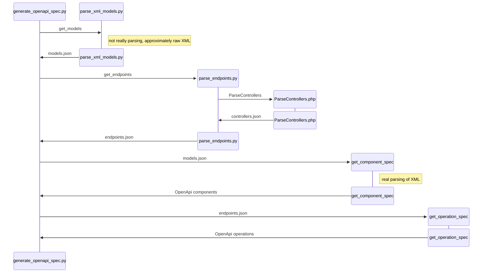

# Sequence diagram

```mermaid
sequenceDiagram
    %% box G
    %% participant generate_openapi_spec.py
    %% participant get_component_spec
    %% participant get_operation_spec
    %% end
    %% box x
    %% participant parse_xml_models.py
    %% end
    %% create participant get_operation_spec

    %% activate get_component_spec

    generate_openapi_spec.py->>parse_xml_models.py: get_models
    note right of parse_xml_models.py: not really parsing, approximately raw XML
    destroy parse_xml_models.py
    parse_xml_models.py->>generate_openapi_spec.py: models.json

    %% box e
    %% participant parse_endpoints.py
    %% participant ParseControllers.php
    %% end
    create participant parse_endpoints.py
    generate_openapi_spec.py->>parse_endpoints.py: get_endpoints
    create participant ParseControllers.php
    parse_endpoints.py->>ParseControllers.php: ParseControllers
    destroy ParseControllers.php
    ParseControllers.php->>parse_endpoints.py: controllers.json
    destroy parse_endpoints.py
    parse_endpoints.py->>generate_openapi_spec.py: endpoints.json

    %% box G
    %% participant generate_openapi_spec.py
    %% participant get_component_spec
    %% participant get_operation_spec
    %% end
    create participant get_component_spec
    generate_openapi_spec.py->>get_component_spec: models.json
    note right of get_component_spec: real parsing of XML
    destroy get_component_spec
    get_component_spec->>generate_openapi_spec.py: OpenApi components

    create participant get_operation_spec
    generate_openapi_spec.py->>get_operation_spec: endpoints.json
    destroy get_operation_spec
    get_operation_spec->>generate_openapi_spec.py: OpenApi operations
```
