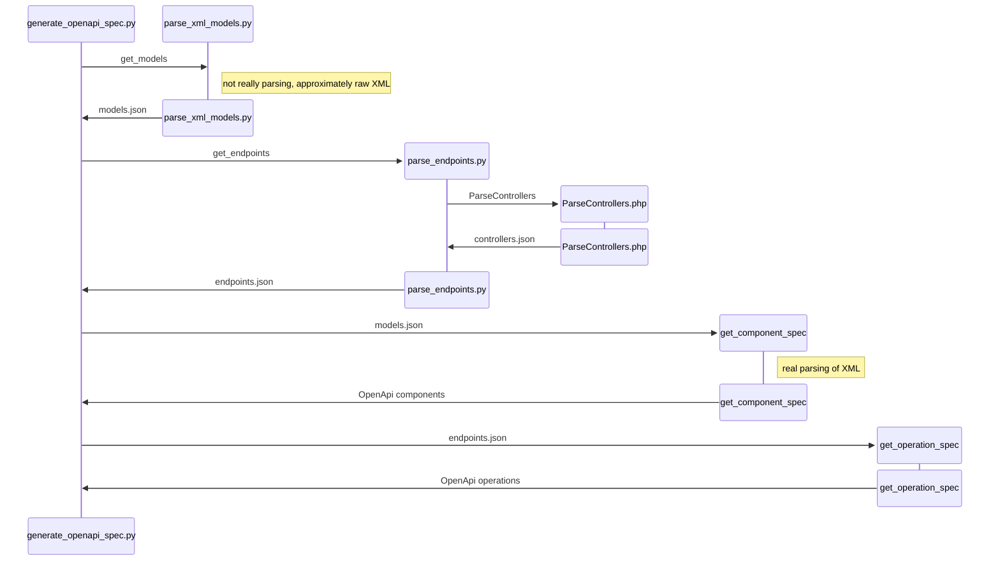

# Sequence diagram



I stress that, to put together PRs, I've ripped apart my PoC and I am currently non-functional. This json is massaged to demonstrate intent.

controllers.json (output from PHP reflection):

```json
{
    "OPNsense\\Auth\\Api\\GroupController": {
        "name": "OPNsense\\Auth\\Api\\GroupController",
        "parent": "OPNsense\\Base\\ApiMutableModelControllerBase",
        "methods": [
            {
                "name": "get",
                "method": "GET",
                "parameters": [
                    {
                        "name": "uuid",
                        "has_default": true,
                        "default": null
                    }
                ],
                "doc": "Retrieve model settings"
            }
        ],
        "model": "OPNsense\\Auth\\Group",
        "is_abstract": false,
        "doc": "Class GroupController"
    },
```

endpoints.json:

```json
[
    {
        "description": "Retrieve model settings",
        "path": "/auth/group/get",
        "method": "GET",
        "parameters": [
            {
                "name": "uuid",
                "has_default": true,
                "default": null
            }
        ],
        "model": "opnsense.auth.group"
    },
```

OpenApi spec:

```json

```
