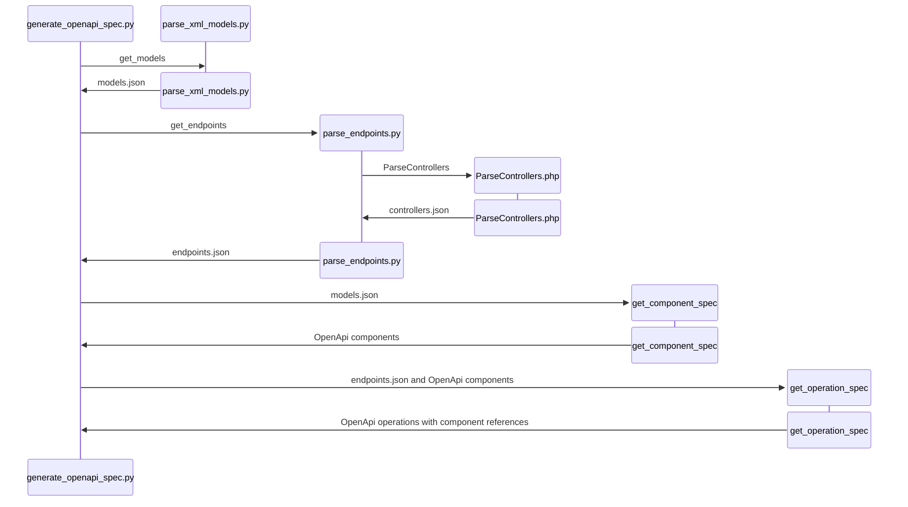

This is intended to provide a high-level overview, with more detail on the most challenging parts of the code.

- [Sequence diagram](#sequence-diagram)
- [parse\_xml\_models.py](#parse_xml_modelspy)
  - [Output from parse\_xml\_models.py](#output-from-parse_xml_modelspy)
- [ParseControllers.php](#parsecontrollersphp)
  - [Looking for POST requests](#looking-for-post-requests)
  - [Looking for paths that relate models to request bodies](#looking-for-paths-that-relate-models-to-request-bodies)
  - [Output from ParseControllers.php](#output-from-parsecontrollersphp)
- [parse\_endpoints.py](#parse_endpointspy)
  - [Output from parse\_endpoints.py](#output-from-parse_endpointspy)
- [generate\_openapi\_spec.py](#generate_openapi_specpy)
  - [Parsing XML models into spec components](#parsing-xml-models-into-spec-components)
  - [Parsing endpoint paths relative to model paths](#parsing-endpoint-paths-relative-to-model-paths)
  - [Output from generate\_openapi\_spec](#output-from-generate_openapi_spec)
- [Code metrics](#code-metrics)

## Sequence diagram



## parse_xml_models.py

[Source (alpha-1)](https://github.com/fsackur/opnsense_plugins/blob/alpha-1/devel/openapi/src/opnsense/scripts/parse_xml_models.py)

This does nothing interesting. It is a transparant map from XML into dataclasses. It hides the filesystem and the XML syntax.

Output is a list of trees that exactly mirror the model XML.

### Output from parse_xml_models.py

<details><summary>models.json</summary>

```json
{
    "type": null,
    "name": "items",
    "value": "",
    "children": [
        {
            "type": null,
            "name": "geoip",
            "value": "",
            "children": [
                {
                    "type": "UrlField",
                    "name": "url",
                    "value": null,
                    "children": []
                }
            ]
        },
        {
            "type": null,
            "name": "aliases",
            "value": "",
            "children": [
                {
                    "type": "AliasField",
                    "name": "alias",
                    "value": "",
                    "children": [
                        {
                            "type": "BooleanField",
                            "name": "enabled",
                            "value": "",
                            "children": [
                                {
                                    "type": null,
                                    "name": "Default",
                                    "value": "1",
                                    "children": []
                                },
                                {
                                    "type": null,
                                    "name": "Required",
                                    "value": "Y",
                                    "children": []
                                }
                            ]
                        },
```

</details>

## ParseControllers.php

[Source (alpha-1)](https://github.com/fsackur/opnsense_plugins/blob/alpha-1/devel/openapi/src/opnsense/scripts/ParseControllers.php)

Uses reflection to pull most of the data. We also use regex to:

- detect HTTP POST
- detect request bodies
- find the map of body properties to XML paths (i.e. the params to setBase/AddBase etc)

Output is a list of Controllers, which have Methods, which have Parameters.

Output has snake_case property names, but values are PHP-flavoured; no case change or backslash replacement or doc comment parsing.

### Looking for POST requests

<details><summary>Method.__construct</summary>

```php
$BASE_METHOD_HTTP_METHODS = [
    "request->isPost" => "POST",
    "request->hasPost" => "POST",
    "request->getPost" => "POST",
    "delBase" => "POST",
    "addBase" => "POST",
    "setBase" => "POST",
    "toggleBase" => "POST",
    "searchBase" => "*",  // in the existing script, this means GET and POST are both accepted
    // "searchBase" => "POST"  // would be simpler; I can live with it (or GET)
];

$matches = null;
$after_deref = "(?<=\\\$this->)";   // lookbehind for "$this->"
$before_bracket = "(?=\()";         // lookahead for "("
$call = "\S+";                      // non-space
$pattern = "/" . $after_deref . $call . $before_bracket . "/";
preg_match_all($pattern, $src, $matches);

$http_method = "GET";
$requires_body = False;
foreach ($matches[0] as $call) {
    if (array_key_exists($call, self::$BASE_METHOD_HTTP_METHODS)) {
        $http_method = self::$BASE_METHOD_HTTP_METHODS[$call];
    }
    $requires_body = $requires_body || $call === "request->getPost";
}
```

</details>

### Looking for paths that relate models to request bodies

<details><summary>Method.__construct</summary>

```php
$matches = null;
$pattern = "/\\\$this->(search|get|add|del|set|toggle)Base\(([^\)]*)\)/";
preg_match_all($pattern, $src, $matches);

$model_path_map = null;
if ($matches[0]) {
    // Multiple calls to delBase in IPsec\Api\ConnectionsController and
    // Unbound\Api\SettingsController. In both cases, the earlier calls are
    // "cascade deletes", and it seems probable that the last call is always
    // going to be the "main" model change. So we'll take the last match
    // for each capture group.
    $base_method = array_slice($matches[1], -1)[0] . "Base";
    $args = preg_split("/,\s*/", trim(array_slice($matches[2], -1)[0]));

    if (in_array($base_method, ["addBase", "setBase", "getBase"])) {
        $model_path_map = $args[0] . ":" . $args[1];
    } else {
        $model_path_map = ":" . $args[0];
    }

    $model_path_map = preg_replace("/\"|'/", "", $model_path_map);
}
```

</details>

### Output from ParseControllers.php

<details><summary>controllers.json</summary>

```json
{
    "name": "OPNsense\\Firewall\\Api\\AliasController",
    "parent": "OPNsense\\Base\\ApiMutableModelControllerBase",
    "methods": [
        {
            "name": "get",
            "method": "GET",
            "parameters": [],
            "doc": "/**\n     * Retrieve model settings\n     * @return array settings\n     * @throws \\ReflectionException when not bound to a valid model\n     */",
            "requires_body": false,
            "model_path_map": null
        },
        {
            "name": "set",
            "method": "POST",
            "parameters": [],
            "doc": "/**\n     * Update model settings\n     * @return array status / validation errors\n     * @throws \\OPNsense\\Base\\ValidationException on validation issues\n     * @throws \\ReflectionException when binding to the model class fails\n     * @throws UserException when denied write access\n     */",
            "requires_body": true,
            "model_path_map": null
        },
        {
            "name": "searchItem",
            "method": "*",
            "parameters": [],
            "doc": "/**\n     * search aliases\n     * @return array search results\n     * @throws \\ReflectionException\n     */",
            "requires_body": false,
            "model_path_map": ":aliases.alias"
        },
        {
            "name": "listCategories",
            "method": "GET",
            "parameters": [],
            "doc": "/**\n     * list categories and usage\n     * @return array\n     */",
            "requires_body": false,
            "model_path_map": null
        },
        {
            "name": "setItem",
            "method": "POST",
            "parameters": [
                {
                    "name": "uuid",
                    "has_default": false,
                    "default": null
                }
            ],
            "doc": "/**\n     * Update alias with given properties\n     * @param string $uuid internal id\n     * @return array save result + validation output\n     * @throws \\OPNsense\\Base\\ValidationException when field validations fail\n     * @throws \\ReflectionException when not bound to model\n     */",
            "requires_body": true,
            "model_path_map": "alias:aliases.alias"
        },
        {
            "name": "addItem",
            "method": "POST",
            "parameters": [],
            "doc": "/**\n     * Add new alias and set with attributes from post\n     * @return array save result + validation output\n     * @throws \\OPNsense\\Base\\ModelException when not bound to model\n     * @throws \\OPNsense\\Base\\ValidationException when field validations fail\n     * @throws \\ReflectionException when not bound to model\n     */",
            "requires_body": false,
            "model_path_map": "alias:aliases.alias"
        },
        {
            "name": "getItem",
            "method": "GET",
            "parameters": [
                {
                    "name": "uuid",
                    "has_default": true,
                    "default": null
                }
            ],
            "doc": "/**\n     * Retrieve alias settings or return defaults for new one\n     * @param $uuid item unique id\n     * @return array alias content\n     * @throws \\ReflectionException when not bound to model\n     */",
            "requires_body": false,
            "model_path_map": "alias:aliases.alias"
        },
        {
            "name": "getAliasUUID",
            "method": "GET",
            "parameters": [
                {
                    "name": "name",
                    "has_default": false,
                    "default": null
                }
            ],
            "doc": "/**\n     * find the alias uuid by name\n     * @param $name alias name\n     * @return array uuid\n     * @throws \\ReflectionException\n     */",
            "requires_body": false,
            "model_path_map": null
        },
        {
            "name": "delItem",
            "method": "POST",
            "parameters": [
                {
                    "name": "uuid",
                    "has_default": false,
                    "default": null
                }
            ],
            "doc": "/**\n     * Delete alias by uuid, save contents to tmp for removal on apply\n     * @param string $uuid internal id\n     * @return array save status\n     * @throws \\OPNsense\\Base\\ValidationException when field validations fail\n     * @throws \\ReflectionException when not bound to model\n     * @throws \\OPNsense\\Base\\UserException when unable to delete\n     */",
            "requires_body": false,
            "model_path_map": ":aliases.alias"
        },
        {
            "name": "toggleItem",
            "method": "POST",
            "parameters": [
                {
                    "name": "uuid",
                    "has_default": false,
                    "default": null
                },
                {
                    "name": "enabled",
                    "has_default": true,
                    "default": null
                }
            ],
            "doc": "/**\n     * toggle status\n     * @param string $uuid id to toggled\n     * @param string|null $enabled set enabled by default\n     * @return array status\n     * @throws \\OPNsense\\Base\\ValidationException when field validations fail\n     * @throws \\ReflectionException when not bound to model\n     */",
            "requires_body": false,
            "model_path_map": ":aliases.alias"
        }
    ],
    "model": "OPNsense\\Firewall\\Alias",
    "is_abstract": false,
    "doc": "/**\n * @package OPNsense\\Firewall\n */"
},
```

</details>

## parse_endpoints.py

[Source (alpha-1)](https://github.com/fsackur/opnsense_plugins/blob/alpha-1/devel/openapi/src/opnsense/scripts/parse_endpoints.py)

Wraps `ParseControllers.php`. Processes controller methods from `controllers.json` into `Endpoint` dataclasses.

Controller methods are one-to-one with Endpoints, except for search methods, which produce two endpoints (due to GET and POST).

Processes PHP doc comments, transforms backslashes and normalises model paths (`model_path_map`). `model_path_map` is a tuple of the args passed to setBase/addBase/etc. See: [Parsing endpoint paths relative to model paths](#parsing-endpoint-paths-relative-to-model-paths).

Generates the OpenApi `path` and `operationId`. These are properties, so they are not seen in the json.

### Output from parse_endpoints.py

<details><summary>endpoints.json</summary>

```json
[
    {
        "description": "Retrieve model settings",
        "module": "Firewall",
        "controller": "Alias",
        "name": "get",
        "method": "GET",
        "parameters": [],
        "model": "opnsense.firewall.alias",
        "requires_body": false,
        "model_path_map": null
    },
    {
        "description": "Update model settings",
        "module": "Firewall",
        "controller": "Alias",
        "name": "set",
        "method": "POST",
        "parameters": [],
        "model": "opnsense.firewall.alias",
        "requires_body": true,
        "model_path_map": null
    },
    {
        "description": "search aliases",
        "module": "Firewall",
        "controller": "Alias",
        "name": "searchItem",
        "method": "GET",
        "parameters": [],
        "model": "opnsense.firewall.alias",
        "requires_body": false,
        "model_path_map": ":aliases.alias"
    },
    {
        "description": "search aliases",
        "module": "Firewall",
        "controller": "Alias",
        "name": "searchItem",
        "method": "POST",
        "parameters": [],
        "model": "opnsense.firewall.alias",
        "requires_body": false,
        "model_path_map": ":aliases.alias"
    },
    {
        "description": "list categories and usage",
        "module": "Firewall",
        "controller": "Alias",
        "name": "listCategories",
        "method": "GET",
        "parameters": [],
        "model": "opnsense.firewall.alias",
        "requires_body": false,
        "model_path_map": null
    },
    {
        "description": "Update alias with given properties",
        "module": "Firewall",
        "controller": "Alias",
        "name": "setItem",
        "method": "POST",
        "parameters": [
            {
                "name": "uuid",
                "description": "internal id",
                "has_default": false,
                "default": null
            }
        ],
        "model": "opnsense.firewall.alias",
        "requires_body": true,
        "model_path_map": "alias:aliases.alias"
    },
    {
        "description": "Add new alias and set with attributes from post",
        "module": "Firewall",
        "controller": "Alias",
        "name": "addItem",
        "method": "POST",
        "parameters": [],
        "model": "opnsense.firewall.alias",
        "requires_body": false,
        "model_path_map": "alias:aliases.alias"
    },
    {
        "description": "Retrieve alias settings or return defaults for new one",
        "module": "Firewall",
        "controller": "Alias",
        "name": "getItem",
        "method": "GET",
        "parameters": [
            {
                "name": "uuid",
                "description": "item unique id",
                "has_default": true,
                "default": null
            }
        ],
        "model": "opnsense.firewall.alias",
        "requires_body": false,
        "model_path_map": "alias:aliases.alias"
    },
```

</details>

## generate_openapi_spec.py

[Source (alpha-1)](https://github.com/fsackur/opnsense_plugins/blob/alpha-1/devel/openapi/src/opnsense/scripts/generate_openapi_spec.py)

This module knows about OpenApi specs and about parsing the XML models. It consumes `models.json` and `endpoints.json`.

The OpenApi spec consumes dicts, and typing is anyway painful, so we put our faith in the openapi validation.

### Parsing XML models into spec components

The important method is `get_model_spec`. It generates OpenApi components (data models). Currently, it ignores qualifiers (constraints, default values, required). I am not aiming for completeness with the qualifiers, as most of them don't map to OpenApi concepts.

<details><summary>get_model_spec</summary>

```python
QUALIFIERS = [
    "ValidationMessage",
    "Constraints",
    "Default",
    "Required",
    "Multiple",
    "BlankDesc",
]

ARRAY_FIELD_TYPES = [
    "AliasField",
    "ArrayField",
    "CAsField",
    "CertificatesField",
]

class XmlNode(BaseModel):
    type: str | None
    name: str
    value: str | None
    children: List["XmlNode"]

def get_model_spec(node: XmlNode) -> Dict[str, Any]:
    props = []
    quals = []
    for child in node.children:
        if child.name in QUALIFIERS:
            quals.append(child)
        else:
            props.append(child)

    is_primitive = not any(props)
    is_enum = any(p for p in props if p.name == "OptionValues")
    is_multiple = any(q for q in quals if q.name == "Multiple")
    is_array = is_multiple or props[0].type in ARRAY_FIELD_TYPES

    if is_enum:
        spec = {
            "type": "string",
            "enum": [p.name for p in props[0].children],
        }
    elif is_primitive:
        spec = {
            "type": "string",  # TODO: int/bool/etc
        }
    else:
        spec = {
            "type": "object",
            "properties": {prop.name: get_model_spec(prop) for prop in props},
        }

    if is_array:
        spec = {
            "type": "array",
            "items": spec,
        }

    return spec
```

</details>

### Parsing endpoint paths relative to model paths

There is one more slightly tricky method: `resolve_component_path`. Many controllers do not accept or return the entire XML model. This behaviour is declared in the controllers by the params in calls to setBase/AddBase/etc, and surfaced as a tuple in `model_path_map`.

<details><summary>resolve_component_path</summary>

The job of `resolve_component_path` is to give us a valid `$ref` for request bodies and responses.

Example:

- controller:
  - `$this->setBase("alias", "aliases.alias", $uuid);`
- model_path_map:
  - `alias:aliases.alias`
- resolve_component_path:
  - `("alias", "opnsense.firewall.alias/properties/aliases/items/properties/alias")`
- OpenApi response:
  - `#/components/schemas/opnsense.firewall.alias/properties/aliases/properties/alias`

We have to pass in the components from `get_model_spec`, so that we can pick our way through the arrays and objects.

```python
def resolve_component_path(
    endpoint: Endpoint,
    component_schemas: Dict[str, Dict]  # from get_model_spec
) -> Tuple[Optional[str], Optional[str]]:

    client_prop = None
    if endpoint.model and endpoint.model_path_map:
        client_prop, model_path = endpoint.model_path_map.split(":", maxsplit=2)
        client_prop = client_prop or None

        breadcrumbs = model_path.split(".")
        tree: Dict[str, Dict] = component_schemas.get(endpoint.model)  # type: ignore

        model_path = endpoint.model
        while breadcrumbs:
            prop = breadcrumbs[0]

            if "properties" in tree:
                tree = tree["properties"][prop]
                model_path = f"{model_path}/properties/{prop}"
                breadcrumbs = breadcrumbs[1:]

            elif "items" in tree:  # it's an array. Skip a level.
                tree = tree["items"]
                model_path = f"{model_path}/items"

            else:
                raise KeyError(f"could not find {prop} in {model_path}")
    else:
        model_path = endpoint.model

    return client_prop, model_path
```

</details>

### Output from generate_openapi_spec

<details><summary>openapi.yml</summary>

```yaml
openapi: 3.1.0
info:
  description: API for managing your OPNsense firewall
  title: OPNsense API
  version: '25.1'
paths:
  /firewall/alias/get:
    get:
      operationId: FirewallAliasGet
      responses:
        '200':
          description: Retrieve model settings
          content:
            application/json:
              schema:
                $ref: '#/components/schemas/opnsense.firewall.alias'
    description: Retrieve model settings
  /firewall/alias/set:
    post:
      operationId: FirewallAliasSet_Post
      responses:
        '200':
          description: Update model settings
          content: &id040
            application/json:
              schema:
                $ref: '#/components/schemas/opnsense.firewall.alias'
      requestBody:
        required: true
        content: *id040
    description: Update model settings
  /firewall/alias/searchitem:
    get:
      operationId: FirewallAliasSearchItem
      responses:
        '200':
          description: search aliases
          content:
            application/json:
              schema:
                $ref: '#/components/schemas/opnsense.firewall.alias/properties/aliases/items/properties/alias'
    description: search aliases
    post:
      operationId: FirewallAliasSearchItem_Post
      responses:
        '200':
          description: search aliases
          content:
            application/json:
              schema:
                $ref: '#/components/schemas/opnsense.firewall.alias/properties/aliases/items/properties/alias'
  /firewall/alias/listcategories:
    get:
      operationId: FirewallAliasListCategories
      responses:
        '200':
          description: list categories and usage
          content:
            application/json:
              schema:
                $ref: '#/components/schemas/opnsense.firewall.alias'
    description: list categories and usage
  /firewall/alias/setitem/{uuid}:
    post:
      operationId: FirewallAliasSetItem_Post
      responses:
        '200':
          description: Update alias with given properties
          content: &id041
            application/json:
              schema:
                type: object
                properties:
                  alias:
                    $ref: '#/components/schemas/opnsense.firewall.alias/properties/aliases/items/properties/alias'
      parameters:
      - in: path
        name: uuid
        schema:
          type: string
        required: true
      requestBody:
        required: true
        content: *id041
    description: Update alias with given properties
  /firewall/alias/additem:
    post:
      operationId: FirewallAliasAddItem_Post
      responses:
        '200':
          description: Add new alias and set with attributes from post
          content:
            application/json:
              schema:
                type: object
                properties:
                  alias:
                    $ref: '#/components/schemas/opnsense.firewall.alias/properties/aliases/items/properties/alias'
    description: Add new alias and set with attributes from post
  /firewall/alias/getitem/{uuid}:
    get:
      operationId: FirewallAliasGetItem
      responses:
        '200':
          description: Retrieve alias settings or return defaults for new one
          content:
            application/json:
              schema:
                type: object
                properties:
                  alias:
                    $ref: '#/components/schemas/opnsense.firewall.alias/properties/aliases/items/properties/alias'
      parameters:
      - in: path
        name: uuid
        schema:
          type: string
        required: true
    description: Retrieve alias settings or return defaults for new one
  /firewall/alias/getaliasuuid/{name}:
    get:
      operationId: FirewallAliasGetAliasUUID
      responses:
        '200':
          description: find the alias uuid by name
          content:
            application/json:
              schema:
                $ref: '#/components/schemas/opnsense.firewall.alias'
      parameters:
      - in: path
        name: name
        schema:
          type: string
        required: true
    description: find the alias uuid by name
  /firewall/alias/delitem/{uuid}:
    post:
      operationId: FirewallAliasDelItem_Post
      responses:
        '200':
          description: Delete alias by uuid, save contents to tmp for removal on apply
          content:
            application/json:
              schema:
                $ref: '#/components/schemas/opnsense.firewall.alias/properties/aliases/items/properties/alias'
      parameters:
      - in: path
        name: uuid
        schema:
          type: string
        required: true
    description: Delete alias by uuid, save contents to tmp for removal on apply
  /firewall/alias/toggleitem/{uuid}/{enabled}:
    post:
      operationId: FirewallAliasToggleItem_Post
      responses:
        '200':
          description: toggle status
          content:
            application/json:
              schema:
                $ref: '#/components/schemas/opnsense.firewall.alias/properties/aliases/items/properties/alias'
      parameters:
      - in: path
        name: uuid
        schema:
          type: string
        required: true
      - in: path
        name: enabled
        schema:
          type: string
        required: true
    description: toggle status
  /firewall/alias/listcountries:
    get:
      operationId: FirewallAliasListCountries
      responses:
        '200':
          description: list countries and regions
          content:
            application/json:
              schema:
                $ref: '#/components/schemas/opnsense.firewall.alias'
    description: list countries and regions
  /firewall/alias/listusergroups:
    get:
      operationId: FirewallAliasListUserGroups
      responses:
        '200':
          description: list user groups
          content:
            application/json:
              schema:
                $ref: '#/components/schemas/opnsense.firewall.alias'
    description: list user groups
  /firewall/alias/listnetworkaliases:
    get:
      operationId: FirewallAliasListNetworkAliases
      responses:
        '200':
          description: list network alias types
          content:
            application/json:
              schema:
                $ref: '#/components/schemas/opnsense.firewall.alias'
    description: list network alias types
  /firewall/alias/reconfigure:
    post:
      operationId: FirewallAliasReconfigure_Post
      responses:
        '200':
          description: reconfigure aliases
          content:
            application/json:
              schema:
                $ref: '#/components/schemas/opnsense.firewall.alias'
    description: reconfigure aliases
  /firewall/alias/gettablesize:
    get:
      operationId: FirewallAliasGetTableSize
      responses:
        '200':
          description: get aliases load stats and table-entries limit
          content:
            application/json:
              schema:
                $ref: '#/components/schemas/opnsense.firewall.alias'
    description: get aliases load stats and table-entries limit
  /firewall/alias/export:
    post:
      operationId: FirewallAliasExport_Post
      responses:
        '200':
          description: export configured aliases
          content:
            application/json:
              schema:
                $ref: '#/components/schemas/opnsense.firewall.alias'
    description: export configured aliases
  /firewall/alias/import:
    post:
      operationId: FirewallAliasImport_Post
      responses:
        '200':
          description: import delivered aliases in post variable "data", validate
            all only commit when fully valid.
          content: &id042
            application/json:
              schema:
                $ref: '#/components/schemas/opnsense.firewall.alias'
      requestBody:
        required: true
        content: *id042
    description: import delivered aliases in post variable "data", validate all only
      commit when fully valid.
  /firewall/alias/getgeoip:
    get:
      operationId: FirewallAliasGetGeoIP
      responses:
        '200':
          description: get geoip settings (and stats)
          content:
            application/json:
              schema:
                $ref: '#/components/schemas/opnsense.firewall.alias'
    description: get geoip settings (and stats)
components:
  schemas:
    status:
      type: object
      properties:
        status:
          type: string
    opnsense.firewall.alias:
      type: object
      properties:
        geoip:
          type: object
          properties:
            url:
              type: string
        aliases:
          type: array
          items:
            type: object
            properties:
              alias:
                type: object
                properties:
                  enabled:
                    type: string
                  name:
                    type: string
                  type:
                    type: string
                    enum:
                    - host
                    - network
                    - port
                    - url
                    - urltable
                    - urljson
                    - geoip
                    - networkgroup
                    - mac
                    - asn
                    - dynipv6host
                    - authgroup
                    - internal
                    - external
                  path_expression:
                    type: string
                  proto:
                    type: array
                    items:
                      type: string
                      enum:
                      - IPv4
                      - IPv6
                  interface:
                    type: string
                  counters:
                    type: string
                  updatefreq:
                    type: string
                  content:
                    type: string
                  password:
                    type: string
                  username:
                    type: string
                  authtype:
                    type: string
                    enum:
                    - Basic
                    - Bearer
                  categories:
                    type: array
                    items:
                      type: object
                      properties:
                        Model:
                          type: object
                          properties:
                            rulesets:
                              type: object
                              properties:
                                source:
                                  type: string
                                items:
                                  type: string
                                display:
                                  type: string
                  current_items:
                    type: string
                  last_updated:
                    type: string
                  description:
                    type: string
```

</details>

## Code metrics

- lines of code: 1020 (python: 667, php: 353)
- yaml size: 500KB
- generation time (i3-9100): 1.34s
- generation time (with spec validation): 4.28s
- python process max memory used (aximum resident set size): 74MB
- python process max memory used (with spec validation): 74MB
